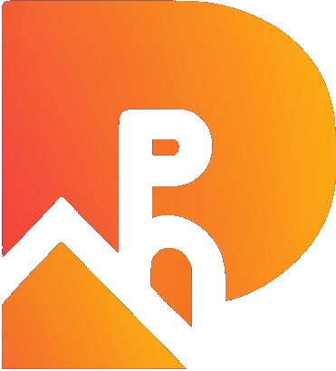

<p align="center">
  
</p>

<h1 align="center">PromptCraft - AI-Powered Prompt Generator</h1>

<p align="center">Unleash Creativity with AI-Generated Prompts</p>

<p align="center">
  <a href="https://promptcraft.netlify.app/" target="_blank">
    🚀 Live Demo
  </a>
  •
  <a href="#features">
    ✨ Features
  </a>
  •
  <a href="#getting-started">
    🛠️ Getting Started
  </a>
  •
  <a href="#technologies-used">
    🛡️ Technologies Used
  </a>
  •
  <a href="#contributing">
    🤝 Contributing
  </a>
  •
  <a href="#Acknowledgments">
    🙏 Acknowledgments
  </a>
</p>


## ✨ Features


### 1. Unleash Your Creativity

PromptCraft empowers creators with a robust AI-driven prompt generator, designed to fuel your artistic and AI projects with an endless stream of inspiring ideas. Whether you're an artist, writer, or developer, PromptCraft provides the spark you need to take your projects to new heights. With the power of AI at your fingertips, your creative potential knows no bounds.

### 2. Community-Driven Prompts

Dive into a treasure trove of prompts crafted by a vibrant and passionate community. Discover, share, and be inspired by the collective creativity of like-minded individuals. Explore an ever-growing library of prompts that cover a wide range of themes and topics. Connect with fellow creators, exchange ideas, and build a network that fosters innovation and collaboration.

### 3. Effortless Sign-In

Experience a seamless onboarding process by logging in via Google. Join a welcoming community of creators who share your passion for unleashing creativity. Your personalized PromptCraft experience begins with a simple and secure sign-in. Say goodbye to lengthy registration forms and hello to a world of inspiration.

### 4. Secure & Scalable

PromptCraft is backed by a robust MongoDB database, ensuring the security and scalability of your prompts. Your creative work deserves a reliable foundation that can grow with your ambitions. Rest assured that your prompts are safe and accessible whenever you need them. Focus on what matters most—your creative journey.

### 5. Stunning & Responsive UI

Tailwind CSS powers a visually stunning and responsive user interface, making your experience on PromptCraft a delight. Whether you're browsing prompts on a desktop, tablet, or smartphone, PromptCraft adapts effortlessly to your device. Enjoy a smooth and visually pleasing interface that enhances your creative journey.

# Prompt Sharing App

This is a prompt sharing web app built with Next.js, MongoDB, Tailwind CSS, and NextAuth for authentication.

## Features

- **Share Text Prompts**: Share text prompts and view prompts shared by others.
- **Like and Unlike Prompts**: Interact with prompts by liking or unliking them.
- **Tag Prompts**: Categorize prompts with relevant topics.
- **User Profiles**: Manage your shared prompts and user profile.
- **Login with Google**: Authenticate using your Google account with NextAuth.

## Usage

### Login

Login using your Google account. This will create a user profile if one does not exist.

### Home View

The home page shows a feed of recently shared prompts. You can like or unlike prompts here.

### Profile View

Access your profile page from the navbar. Here you can:

- View prompts you have shared
- Edit or delete your own prompts
- Share a new prompt

### Sharing Prompts

Share prompts from the navbar or your profile page. Add tags to help categorize your prompt.

## Built With

- [Next.js](https://nextjs.org/) - React framework
- [Tailwind CSS](https://tailwindcss.com/) - For styling
- [MongoDB](https://www.mongodb.com/) - Database
- [NextAuth](https://next-auth.js.org/) - Authentication


## 🛠️ Getting Started

To run PromptCraft locally, follow these simple steps:

1. **Clone this Repository**:

   ```bash
   git clone https://github.com/mmnsrti/promptcraft.git
1.Install Dependencies:

cd promptcraft
npm install

2.Configure Environment Variables:

3.Create a .env.local file in the project root and add your MongoDB URI and Google OAuth credentials:
GOOGLE_ID=
GOOGLE_CLIENT_SECRET=
MONGO_URI=
NEXTAUTH_URL=http://localhost:3000
NEXTAUTH_URL_INTERNAL=http://localhost:3000
NEXTAUTH_SECRET=

4.Start the Development Server:
npm run dev


## 🛡️ technologies-used
Next.js: The foundation of our project, delivering a fast and efficient React framework.
MongoDB: Our database of choice for prompt storage and management.
Tailwind CSS: A utility-first CSS framework for crafting a stylish and responsive UI.

## 🤝 contributing
We enthusiastically welcome contributions from the community! If you're eager to contribute to PromptCraft, please read our Contributing Guidelines.


## 🙏 Acknowledgments

Our heartfelt gratitude to the vibrant open-source community for providing the tools and libraries that empower this project.
Inspired by the limitless creative potential unlocked by AI-generated prompts.
Crafted with ❤️ by mmnsrti 
For additional information, visit the PromptCraft GitHub repository.

